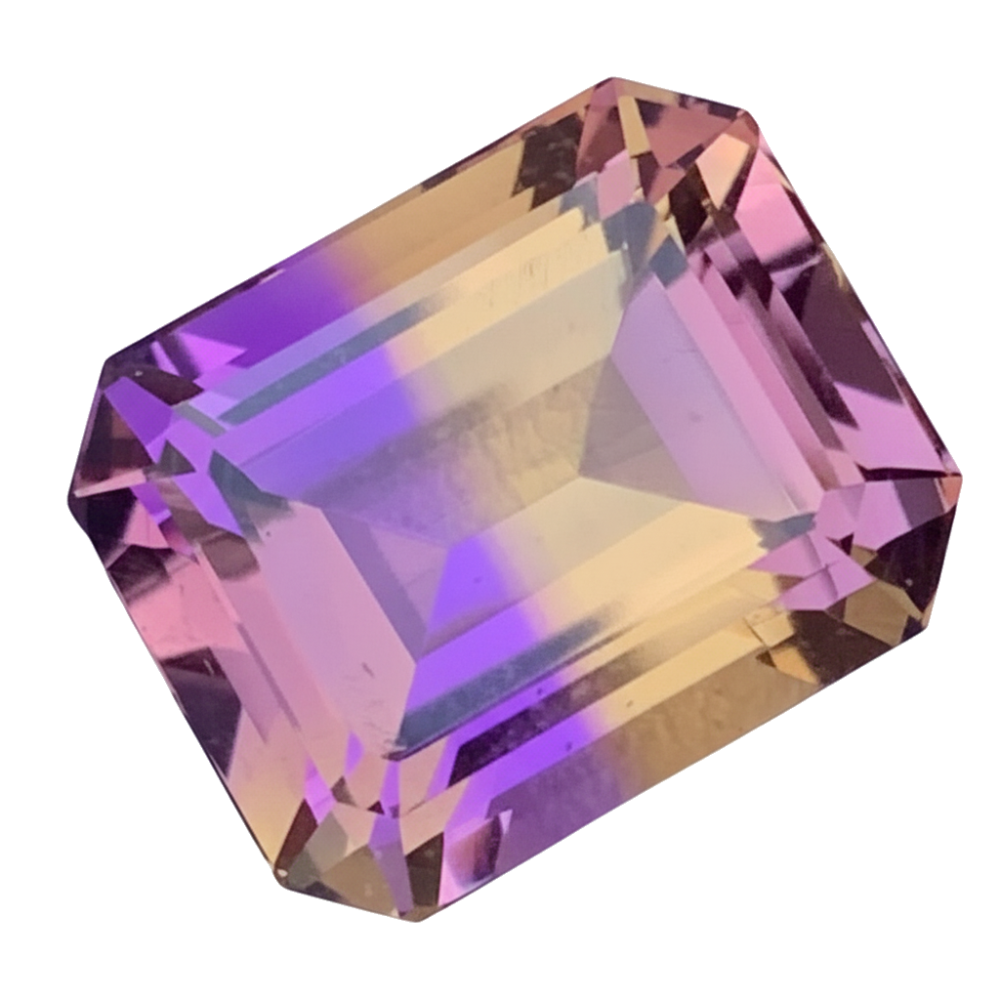

<div align="center">
  

# Ametrine

A modern digital garden built with Astro, featuring wikilinks, backlinks, graph visualization, and full-text search.

</div>

## Features

- **Wikilink Support**: Use `[[Page Name]]` syntax to link between notes
- **Backlinks**: Automatically see which pages link to the current page
- **Graph Visualization**: Interactive D3 force-directed graph of note connections
- **Full-Text Search**: Fast search across all notes with Cmd+K shortcut
- **Table of Contents**: Auto-generated TOC with scroll highlighting
- **Tags**: Organize notes with tags and browse by tag
- **Dark Mode**: System-aware theme with manual toggle
- **Responsive**: Three-column layout that adapts to screen size
- **Fast**: Built with Astro for optimal performance
- **Smart Caching**: LocalStorage caching prevents layout jitter

## Project Structure

```text
/
├── public/              # Static assets (favicon, images)
├── src/
│   ├── components/      # Astro and React components
│   ├── content/
│   │   └── vault/       # Your notes (.md), bases (.base), canvases (.canvas), bibliography.bib
│   ├── layouts/         # Page layouts
│   ├── pages/           # Routes and API endpoints
│   ├── plugins/         # Remark/Rehype plugins
│   ├── styles/          # Global CSS
│   ├── utils/           # Utility functions
│   └── config.ts        # Site configuration
└── package.json
```

## Commands

All commands are run from the root of the project, from a terminal:

| Command             | Action                                           |
| :------------------ | :----------------------------------------------- |
| `bun install`       | Installs dependencies                            |
| `bun run setup`     | Show setup checklist for new installations       |
| `bun run dev`       | Starts local dev server at `localhost:4321`      |
| `bun run build`     | Build your production site to `./dist/`          |
| `bun run preview`   | Preview your build locally, before deploying     |
| `bun run astro ...` | Run CLI commands like `astro add`, `astro check` |

## Getting Started

### Quick Setup

1. **Install dependencies:**
   ```sh
   bun install
   ```

2. **View setup checklist:**
   ```sh
   bun run setup
   ```

3. **Customize your site** (`src/config.ts`):
   - [ ] Update `pageTitle`, `defaultDescription`
   - [ ] Set `baseUrl` (full URL like `https://yourdomain.com`)
   - [ ] Set `basePath` (`"/"` for root domain, `"/repo-name"` for GitHub Pages)
   - [ ] Modify `footer.links` (replace GitHub link)
   - [ ] Customize theme colors and typography
   - [ ] Replace logo in `public/ametrine.png`
   - [ ] Delete or replace example notes in `src/content/vault/`

4. **Start developing:**
   ```sh
   bun run dev
   ```

## Customization

- Edit `src/config.ts` to change site title, theme, and typography
- Customize styles in `src/styles/global.css`

## Deployment

Build your site for production:

```sh
bun run build
```

Deploy the `./dist/` folder to any static hosting service (Vercel, Netlify, Cloudflare Pages, etc.)

## Thanks

Inspired by [Quartz](https://github.com/jackyzha0/quartz)

## License

MIT
