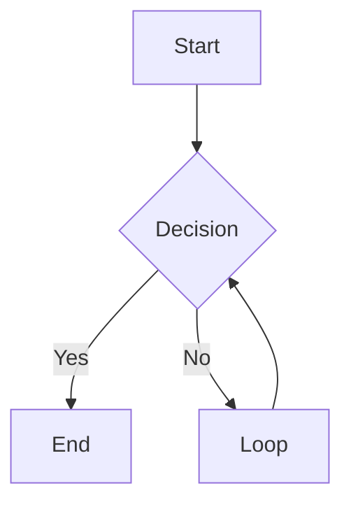
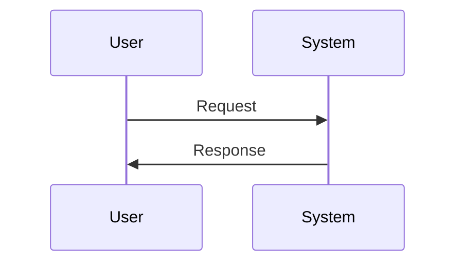
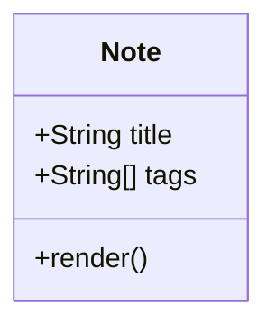

# Syntax Reference

Quick copy-paste reference for all Ametrine syntax features. Each example shows both the markdown source and the rendered result.

## Wikilinks

### Basic Link

```markdown
[[Quick Start]]
```
Result: [[Quick Start]]

### Link with Alias

```markdown
[[Configuration Guide|customize your site]]
```
Result: [[Configuration Guide|customize your site]]

### Link to Section

```markdown
[[Deployment Guide#netlify]]
```
Result: [[Deployment Guide#netlify]]

### Section with Alias

```markdown
[[Configuration Guide#theme-customization|theme colors]]
```
Result: [[Configuration Guide#theme-customization|theme colors]]

## Highlights

### Text Highlighting

```markdown
This is ==highlighted text== in your note.
```
Result: This is ==highlighted text== in your note.

### Multiple Highlights

```markdown
==First highlight== and ==second highlight== in one sentence.
```
Result: ==First highlight== and ==second highlight== in one sentence.

## Marginalia

### Basic Margin Note

```markdown
This is regular text{{This appears in the margin}}.
```
Result: This is regular text{{This appears in the margin}}.

### Multiple Margin Notes

```markdown
First point{{First note}} and second point{{Second note}}.
```
Result: First point{{First note}} and second point{{Second note}}.

### Margin Note with Markdown

```markdown
Regular text{{**Bold**, _italic_, and `code` in margins}}.
```
Result: Regular text{{**Bold**, _italic_, and `code` in margins}}.

See [[documentation/marginalia-demo]] for comprehensive examples.

## Callouts

### Note Callout

```markdown
> [!note] Title
> This is a note callout.
```
Result:
> [!note] Title
> This is a note callout.

### Tip Callout

```markdown
> [!tip] Pro Tip
> Use callouts to highlight important information.
```
Result:
> [!tip] Pro Tip
> Use callouts to highlight important information.

### Warning Callout

```markdown
> [!warning] Watch Out
> This is important to note.
```
Result:
> [!warning] Watch Out
> This is important to note.

### Error Callout

```markdown
> [!error] Error
> Something went wrong.
```
Result:
> [!error] Error
> Something went wrong.

### Example Callout

```markdown
> [!example] Example
> Here's how to do it.
```
Result:
> [!example] Example
> Here's how to do it.

### Question Callout

```markdown
> [!question] Did You Know?
> Callouts support markdown.
```
Result:
> [!question] Did You Know?
> Callouts support markdown.

### Success Callout

```markdown
> [!success] Complete
> Task finished successfully.
```
Result:
> [!success] Complete
> Task finished successfully.

### Callout without Title

```markdown
> [!note]
> You can omit the title.
```
Result:
> [!note]
> You can omit the title.

### Multi-paragraph Callout

```markdown
> [!tip] Multiple Paragraphs
> First paragraph here.
>
> Second paragraph here.
>
> - List item 1
> - List item 2
```
Result:
> [!tip] Multiple Paragraphs
> First paragraph here.
>
> Second paragraph here.
>
> - List item 1
> - List item 2

See [[documentation/obsidian-features-demo]] for more examples.

## Mermaid Diagrams

### Flowchart

````markdown

````

Result:


### Sequence Diagram

````markdown

````

Result:


### Class Diagram

````markdown

````

Result:


See [[documentation/obsidian-features-demo]] for more diagram types.

## Math (LaTeX)

### Inline Math

```markdown
The equation $E = mc^2$ is famous.
```
Result: The equation $E = mc^2$ is famous.

### Block Math

```markdown
$$
\int_0^\infty e^{-x^2} dx = \frac{\sqrt{\pi}}{2}
$$
```

Result:
$$
\int_0^\infty e^{-x^2} dx = \frac{\sqrt{\pi}}{2}
$$

### Common Math Symbols

```markdown
- Greek: $\alpha, \beta, \gamma, \delta$
- Operators: $\sum, \int, \prod, \lim$
- Relations: $\leq, \geq, \neq, \approx$
- Sets: $\in, \subset, \cup, \cap$
```

Result:
- Greek: $\alpha, \beta, \gamma, \delta$
- Operators: $\sum, \int, \prod, \lim$
- Relations: $\leq, \geq, \neq, \approx$
- Sets: $\in, \subset, \cup, \cap$

## Citations

### Basic Citation

```markdown
This is cited[@key2023].
```
Result: This is cited[@key2023].

### Multiple Citations

```markdown
Multiple sources[@key1; @key2; @key3].
```
Result: Multiple sources[@key1; @key2; @key3].

### Citation with Page

```markdown
Quote from source[@key2023, p. 42].
```
Result: Quote from source[@key2023, p. 42].

> [!note] Bibliography Required
> Citations require a `bibliography.bib` file in your vault directory. See [[documentation/configuration-guide#citations]].

## Code Blocks

### Inline Code

```markdown
Use `const x = 42` for constants.
```
Result: Use `const x = 42` for constants.

### JavaScript

````markdown
```javascript
function greet(name) {
  console.log(`Hello, ${name}!`);
}
```
````

Result:
```javascript
function greet(name) {
  console.log(`Hello, ${name}!`);
}
```

### TypeScript

````markdown
```typescript
interface User {
  id: number;
  name: string;
}
```
````

Result:
```typescript
interface User {
  id: number;
  name: string;
}
```

### Python

````markdown
```python
def fibonacci(n):
    if n <= 1:
        return n
    return fibonacci(n-1) + fibonacci(n-2)
```
````

Result:
```python
def fibonacci(n):
    if n <= 1:
        return n
    return fibonacci(n-1) + fibonacci(n-2)
```

### Bash

````markdown
```bash
bun run dev
bun run build
```
````

Result:
```bash
bun run dev
bun run build
```

### JSON

````markdown
```json
{
  "name": "ametrine",
  "version": "1.0.0"
}
```
````

Result:
```json
{
  "name": "ametrine",
  "version": "1.0.0"
}
```

## Standard Markdown

### Headings

```markdown
# Heading 1
## Heading 2
### Heading 3
#### Heading 4
```

### Text Formatting

```markdown
**Bold text**
*Italic text*
***Bold and italic***
~~Strikethrough~~
```
Result: **Bold text**, *Italic text*, ***Bold and italic***, ~~Strikethrough~~

### Lists

#### Unordered Lists

```markdown
- Item 1
- Item 2
  - Nested item
  - Another nested
- Item 3
```

Result:
- Item 1
- Item 2
  - Nested item
  - Another nested
- Item 3

#### Ordered Lists

```markdown
1. First item
2. Second item
3. Third item
   1. Nested numbered
   2. Another nested
```

Result:
1. First item
2. Second item
3. Third item
   1. Nested numbered
   2. Another nested

#### Task Lists

```markdown
- [x] Completed task
- [ ] Incomplete task
- [ ] Another task
```

Result:
- [x] Completed task
- [ ] Incomplete task
- [ ] Another task

### Links

#### External Links

```markdown
[Google](https://google.com)
```
Result: [Google](https://google.com)

#### Auto-links

```markdown
https://google.com
```
Result: https://google.com

### Images

```markdown

```
Result:


### Blockquotes

```markdown
> This is a quote.
> It can span multiple lines.
```

Result:
> This is a quote.
> It can span multiple lines.

### Horizontal Rule

```markdown
---
```

Result:

---

### Tables

```markdown
| Column 1 | Column 2 | Column 3 |
|----------|----------|----------|
| Row 1    | Data     | More     |
| Row 2    | Data     | More     |
```

Result:

| Column 1 | Column 2 | Column 3 |
|----------|----------|----------|
| Row 1    | Data     | More     |
| Row 2    | Data     | More     |

### Footnotes

```markdown
Here's a sentence with a footnote[^1].

[^1]: This is the footnote content.
```

Result:
Here's a sentence with a footnote[^1].

[^1]: This is the footnote content.

## Combining Features

You can combine multiple features:

```markdown
This ==highlighted text== has a margin note{{Important!}} and links to [[Quick Start]].

> [!tip] Combined Features
> You can use **bold**, *italic*, `code`, ==highlights==, and {{marginalia}}
> all together in callouts!
```

Result:
This ==highlighted text== has a margin note{{Important!}} and links to [[Quick Start]].

> [!tip] Combined Features
> You can use **bold**, *italic*, `code`, ==highlights==, and {{marginalia}}
> all together in callouts!

## Frontmatter

Every note should start with frontmatter:

```yaml
---
title: My Note
description: What this note is about
tags: [topic1, topic2]
date: 2025-10-30
author: Your Name
---
```

See [[documentation/frontmatter-reference]] for all available fields.

## Keyboard Shortcuts

### Search
- `Cmd/Ctrl+K` - Open search

### Graph
- `Cmd/Ctrl+G` - Toggle global graph
- `↑↓←→` - Pan graph
- `+/-` - Zoom

### Navigation
- `Tab` - Next element
- `Shift+Tab` - Previous element
- `Esc` - Close modals

## Tips and Tricks

### Escaping Characters

To show literal syntax without rendering:

#### Inline Code

```markdown
Use `[[wikilink]]` to create links.
```
Result: Use `[[wikilink]]` to create links.

#### Code Blocks

Use 4 backticks to show 3-backtick code blocks:

`````markdown
````markdown
```javascript
code here
```
````
`````

### Line Breaks

Two spaces at end of line for soft break:
```markdown
Line 1
Line 2
```

Empty line for paragraph break:
```markdown
Paragraph 1

Paragraph 2
```

### Special Characters

Escape with backslash:
```markdown
\* Not italic \*
\[ Not a link \]
```

## Configuration

Enable/disable features in `src/config.ts`:

```typescript
{
  marginalia: { enable: true },
  gfm: { enableSmartyPants: true },
  citations: { enable: true },
  // ... more options
}
```

See [[documentation/configuration-guide]] for details.

## Resources

### Learn More
- [[documentation/wikilinks-and-graph]] - Linking features
- [[documentation/obsidian-features-demo]] - Feature demonstrations
- [[documentation/marginalia-demo]] - Side notes examples
- [[documentation/advanced-features]] - Advanced functionality

### References
- [Markdown Guide](https://www.markdownguide.org)
- [Mermaid Documentation](https://mermaid.js.org)
- [KaTeX Functions](https://katex.org/docs/supported.html)
- [Obsidian Syntax](https://help.obsidian.md)

## Quick Template

Copy this template for new notes:

```markdown
---
title:
description:
tags: []
date: 2025-10-30
---

#

## Overview

Content here...

## Key Points

- Point 1
- Point 2

## Related

- [[Related Note 1]]
- [[Related Note 2]]
```

Happy writing!
