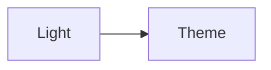
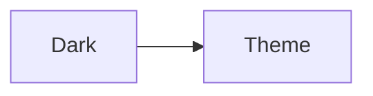

# Advanced Features

Discover Ametrine's powerful advanced features that enhance your digital gardening experience.

## Quick Search

Press **Cmd/Ctrl+K** anywhere to open the search dialog {{Try it now!}}.

### Search Features

- **Instant results** - Search as you type
- **Full-text search** - Matches title, content, and descriptions
- **Keyboard navigation** - Arrow keys + Enter to select
- **Recent searches** - Cached in browser for speed
- **Fuzzy matching** - Finds results even with typos

### Search Tips

**Keyboard shortcuts:**
- `Cmd/Ctrl+K` - Open search
- `↑/↓` - Navigate results
- `Enter` - Go to selected result
- `Esc` - Close search

**Search strategies:**
- Search by title: Type the note name
- Search by content: Type any word in the note
- Search by tag: Type the tag name
- Partial matches work: "config" finds "Configuration Guide"

### Search Under the Hood

The search uses:
- Pre-built content index (at build time)
- localStorage caching for speed
- Fuse.js for fuzzy matching
- React for instant UI updates

The content index includes:
```typescript
{
  title: "Page Title",
  slug: "page-slug",
  description: "Page description",
  content: "Full page text...",
  tags: ["tag1", "tag2"]
}
```

## Link Preview Popovers

Hover over any ==internal wikilink== to see a preview popup {{Like [[this one]]!}}.

### Popover Features

**Hover to preview:**
- Shows page content without navigation
- Includes metadata and tags
- Displays formatted content
- Works with all wikilinks

**Pin to keep open:**
- Click the pin icon
- Popup stays while you browse
- Multiple popups can be pinned
- Session persists across page navigation

**Minimize when done:**
- Click minimize to send to bottom-left
- Minimized popups stay accessible
- Restore by clicking again
- Auto-clears on page reload

**Drag and resize:**
- Drag title bar to reposition
- Drag corner to resize
- Minimum size enforced
- Position persists in session

### Configuration

Control popover behavior in `src/config.ts`:

```typescript
popover: {
  enable: true,              // Master toggle
  hoverDelay: 300,           // ms before showing
  defaultSize: {             // Initial dimensions
    width: 560,
    height: 380
  },
  minSize: {                 // Minimum resize size
    width: 320,
    height: 240
  },
  showFullContent: true,     // Full vs summary
  cacheContent: true,        // Cache for performance
}
```

### Popover Limitations

Popovers are disabled on:
- Touch devices (mobile/tablet)
- Small screens (< 768px)
- External links

This prevents conflicts with touch navigation and scrolling.

## Reader Mode

Toggle reader mode for distraction-free reading.

### What Reader Mode Does

When enabled:
- Hides sidebars and navigation
- Maximizes content area
- Optimal reading width
- Marginalia still visible {{If enabled}}
- Table of contents accessible

### How to Use

Click the book icon in the header to toggle reader mode.

Reader mode is perfect for:
- Long-form reading
- Focused study sessions
- Printing or PDF export
- Presentations

Reader mode persists:
- Across page navigation
- During session
- Resets on page reload

### Configuration

Set max width in `src/config.ts`:

```typescript
marginalia: {
  readerModeMaxWidth: 900  // Max content width
}
```

Adjust based on your typography and marginalia usage.

## Dark Mode

Ametrine includes beautiful dark and light themes.

### Features

- **System-aware** - Matches OS preference on first visit
- **Manual toggle** - Override system preference
- **Persistent** - Saves choice in localStorage
- **Smooth transition** - CSS transitions between themes
- **Mermaid support** - Diagrams adapt to theme

### Theme Colors

Defined in `src/config.ts`:

**Light mode** (default):
- Warm background (#faf8f8)
- Dark gold accents (#b8860b)
- High contrast for readability

**Dark mode** (default):
- Deep purple background (#1a1625)
- Purple accents (#9d7bd8)
- Reduced eye strain

See [[Configuration Guide#Colors]] to customize.

### Dark Mode for Diagrams

Mermaid diagrams automatically adapt:

Light mode:


Dark mode:


The same diagram renders differently based on theme!

## Activity Stats

Visit `/stats` to see your garden's analytics.

### Stats Included

**Overview metrics:**
- Total notes count
- Total word count
- Median reading time
- Average words per note

**Activity heatmap:**
- GitHub-style contribution graph
- Shows last 365 days
- Color intensity = activity level
- Hover for daily counts
- Based on note creation/update dates

**Network statistics:**
- Most linked notes (hub pages)
- Orphan notes (no backlinks)
- Hub notes (5+ connections)
- Total connections

**Reading metrics:**
- Distribution of note lengths
- Reading time estimates
- Longest and shortest notes

### Using Stats

Stats help you:
- Track writing momentum
- Identify content gaps
- Find orphaned notes to connect
- Celebrate progress
- Plan future content

Update frequency: Stats regenerate on each build.

## Table of Contents

Automatically generated from headings on each page.

### TOC Features

- **Auto-generated** - From H2 and H3 headings
- **Scroll highlighting** - Current section highlighted
- **Smooth scrolling** - Click to jump
- **Sticky positioning** - Stays visible while scrolling
- **Responsive** - Hides on mobile

### TOC Behavior

The TOC updates based on scroll position:
1. Detects visible heading
2. Highlights corresponding TOC item
3. Provides visual orientation

Useful for:
- Long articles
- Reference documentation
- Guides and tutorials

### Configuration

TOC appears automatically on pages with 2+ headings.

To hide TOC on a specific page, customize the layout or use CSS.

## Explorer Sidebar

Browse your notes hierarchically.

### Explorer Features

- **File tree view** - Mirrors folder structure
- **Collapsible folders** - Expand/collapse sections
- **Current page highlight** - Shows where you are
- **Persistent state** - Saves open/closed state
- **Responsive** - Adapts to screen size

### Explorer Behavior

The explorer shows:
- All notes in `src/content/notes/`
- Organized by folder structure
- Sorted alphabetically
- Current page highlighted

Click behavior:
- **Folders** - Toggle open/closed (default)
- **Notes** - Navigate to page

State persistence:
- Open/closed state saved to localStorage
- Restores on page load
- Resets if folder structure changes

### Configuration

Configure in `src/components/react/Explorer.tsx`:

```typescript
behavior: "collapse" | "link"
```

- `collapse` - Folders toggle open/closed
- `link` - Folders navigate to index page

## Breadcrumbs

Navigate your site's hierarchy.

### Breadcrumb Features

- **Hierarchy display** - Shows path to current page
- **Clickable links** - Jump to any level
- **Folder resolution** - Uses frontmatter titles
- **Custom separator** - Configurable symbol
- **Responsive** - Hides on mobile

### Example Breadcrumbs

```
Home ❯ Guides ❯ Configuration Guide
```

Each segment is clickable.

### Configuration

Customize in `src/config.ts`:

```typescript
breadcrumbs: {
  spacerSymbol: "❯",              // Separator
  rootName: "Home",                // Root label
  resolveFrontmatterTitle: true,   // Use titles
  showCurrentPage: true,           // Include current
  hideOnRoot: true,                // Hide on homepage
}
```

## Tags System

Organize notes with tags.

### Tag Features

- **Tag pages** - Browse by tag at `/tags/[tag]`
- **Tag index** - See all tags at `/tags`
- **Count display** - Shows # of notes per tag
- **Inline display** - Tags shown with metadata
- **Graph filtering** - Filter graph by tag (future feature)

### Using Tags

Add tags in frontmatter:

```yaml
---
title: My Note
tags: [concept, pkm, evergreen]
---
```

Tags enable:
- Thematic grouping
- Discovery of related content
- Alternative navigation paths
- Content categorization

### Configuration

```typescript
tags: {
  enable: true,              // Master toggle
  showInSidebar: false,      // Tag list in sidebar
  showWithMetadata: true,    // Tags with page info
}
```

## Related Notes

See related content automatically.

### How It Works

Related notes are calculated by:
1. **Shared tags** - Notes with common tags
2. **Link proximity** - Notes in same cluster
3. **Relevance score** - Weighted combination

### Display

Related notes appear at bottom of each page:
- "You might also like..."
- Max 10 notes (configurable)
- Sorted by relevance
- Includes note descriptions

### Configuration

```typescript
linksAndContext: {
  showRelated: true,        // Enable related notes
  relatedLimit: 10,         // Max to show
}
```

## External Links

Track outgoing links automatically.

### Features

- **Auto-detection** - Finds all external links
- **Grouped display** - Listed at page bottom
- **Icon indication** - External link icon
- **OpenGraph fetch** - Preview metadata (optional)

### Configuration

```typescript
linksAndContext: {
  showExternalLinks: true,   // Show external links
  fetchMetadata: false,      // Fetch OG data (slower)
}
```

> [!warning] Build Performance
> Setting `fetchMetadata: true` slows builds significantly as it fetches data from external sites.

## OG Image Generation

Automatic social sharing images.

### Features

- **Auto-generation** - Creates images at build time
- **Customizable** - Uses theme colors
- **Includes metadata** - Title, description, tags
- **Standard size** - 1200×630 (Facebook/Twitter)
- **Efficient** - Only generates for specified paths

### Example OG Image

Each note gets its own `/og/[slug].png` image with:
- Page title
- Description
- Tag list
- Site branding
- Theme colors

### Configuration

```typescript
ogImage: {
  enable: true,
  width: 1200,
  height: 630,
  colorScheme: "darkMode",
  includePaths: ["blog/"],    // Optional
  excludePaths: ["private/"]  // Optional
}
```

## RSS Feed

Automatically generated RSS feed at `/rss.xml`.

### Feed Contents

Includes:
- All published notes
- Sorted by date (newest first)
- Full content or excerpts
- Tags and metadata
- Absolute URLs

### Requirements

Set `baseUrl` in config:

```typescript
baseUrl: "https://your-site.com"
```

### Subscription

Readers can subscribe with:
- Feed readers (Feedly, Inoreader)
- Email services (Blogtrottr)
- Social readers (Feedbin)

Feed updates on every build.

## Keyboard Shortcuts

Master Ametrine with keyboard shortcuts:

### Global Shortcuts
- `Cmd/Ctrl+K` - Open search
- `Cmd/Ctrl+G` - Toggle global graph
- `Esc` - Close modals/search

### Navigation
- `Tab` - Next interactive element
- `Shift+Tab` - Previous element
- Click logo - Return home

### Graph View
- `Arrow keys` - Pan graph
- `+/-` - Zoom in/out
- `Space` - Play/pause timeline

### Search
- `↑/↓` - Navigate results
- `Enter` - Select result
- `Esc` - Close search

## Performance Features

Ametrine is built for speed:

### Static Generation
- All pages pre-rendered at build time
- No server required
- Instant page loads
- CDN-friendly

### SPA Navigation
- Client-side routing
- No full page reloads
- Instant transitions
- Preserves scroll position

### Content Caching
- Search index cached in localStorage
- Popover content cached
- Explorer state persisted
- Theme preference saved

### Image Optimization
- Astro's built-in optimization
- Lazy loading
- Responsive images
- WebP format support

## Accessibility

Ametrine follows accessibility best practices:

- **Semantic HTML** - Proper heading hierarchy
- **Keyboard navigation** - All features accessible
- **ARIA labels** - Screen reader support
- **Color contrast** - WCAG AA compliance
- **Focus indicators** - Visible focus states
- **Alt text** - Images have descriptions

## Next Steps

Now that you've explored advanced features:

- [[Configuration Guide]] - Customize these features
- [[Wikilinks and Graph]] - Master connections
- [[Syntax Reference]] - Quick reference guide
- [[Deployment Guide]] - Deploy your garden

Experiment with each feature to find what works for your workflow!
