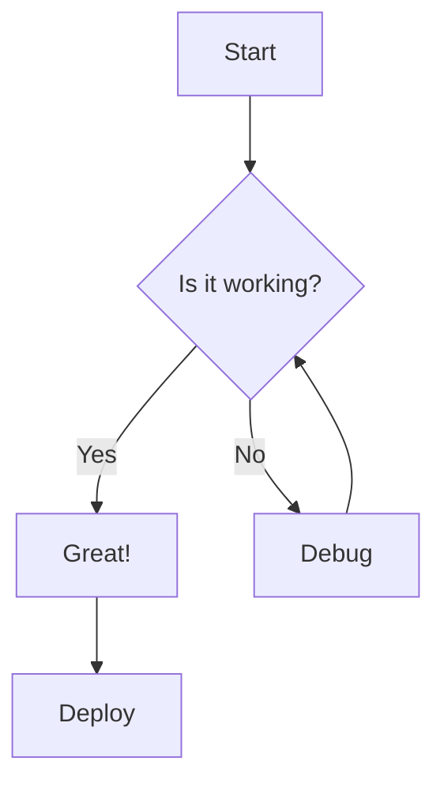
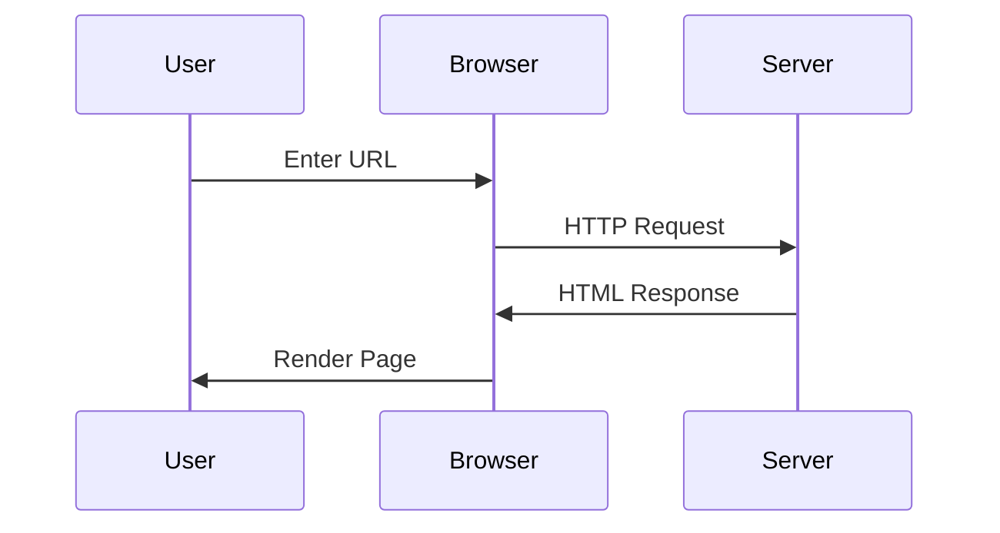
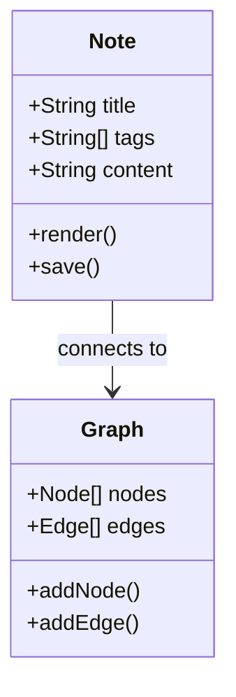
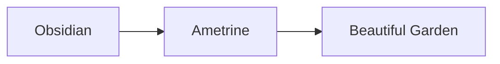

# Obsidian Features Demo

This note demonstrates the three main Obsidian features now supported in Ametrine.

## Highlighting

You can ==highlight important text== using the double equals syntax. This is useful for emphasizing key concepts or terms that you want to ==stand out== in your notes.

Regular **bold** and *italic* text still work as expected, but highlights provide a different visual emphasis.

## Callouts

Obsidian-style callouts allow you to create visually distinct blocks of information:

> [!note] Basic Note
> This is a simple note callout. Use it for general information or observations.

> [!tip] Pro Tip
> Callouts support **markdown formatting** including *italics*, lists, and links!

> [!warning] Important Warning
> Be careful when using this feature - make sure you test it thoroughly before deploying to production.

> [!error] Error Message
> Something went wrong! This callout type is perfect for documenting error conditions.

> [!example] Example Usage
> Here's how you might use this in your notes:
> - First, create a callout with `> [!type]`
> - Add your content on subsequent lines
> - Keep the `>` prefix for all content

> [!question] Did You Know?
> Callouts can contain multiple paragraphs and complex content.
>
> They automatically inherit your theme colors!

## Mermaid Diagrams

Create flowcharts, sequence diagrams, and more using Mermaid syntax:

### Flowchart Example



### Sequence Diagram



### Class Diagram



## Code Blocks

Both inline and block code are fully styled with syntax highlighting.

### Inline Code

You can use `inline code` for short snippets like `const x = 42` or file names like `config.ts`.

### Block Code

Code blocks support syntax highlighting with language tags:

```javascript
function greet(name) {
  console.log(`Hello, ${name}!`);
  return name.toUpperCase();
}

const result = greet('World');
```

```typescript
interface User {
  id: number;
  name: string;
  email: string;
}

const users: User[] = [
  { id: 1, name: 'Alice', email: 'alice@domain.test' },
  { id: 2, name: 'Bob', email: 'bob@domain.test' },
];
```

```python
def fibonacci(n):
    """Calculate the nth Fibonacci number."""
    if n <= 1:
        return n
    return fibonacci(n - 1) + fibonacci(n - 2)

print(fibonacci(10))
```

## Combining Features

You can ==combine all these features== in a single note:

> [!tip] Using Mermaid
> Mermaid diagrams automatically adapt to your ==light or dark theme==!



> [!success] All Features Working
> - ==Highlights== for emphasis
> - Callouts for structured information
> - Mermaid diagrams for visualization
> - All integrated seamlessly!

## Links

These features work alongside existing Ametrine features like [[wikilinks]], backlinks, and the [[knowledge-management|knowledge graph]].
